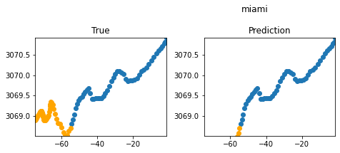
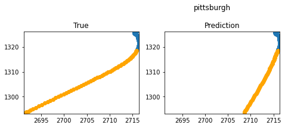
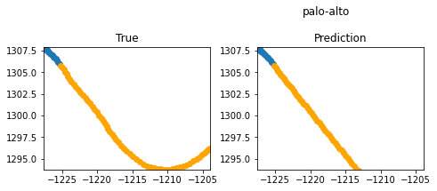
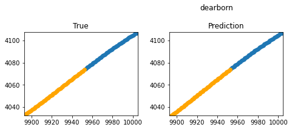

# Argoverse2

The ARGO dataset contains the trajectory path of cars from 6 cities.

### Given initial 5 seconds of the vehicle's trajectory, predict the coordinates of next 6 seconds.

- Implemented LSTM and linear regression predict paths.
- Inlcuded a velocity vector as a feature to improve accuracy.

    
    
    
    

